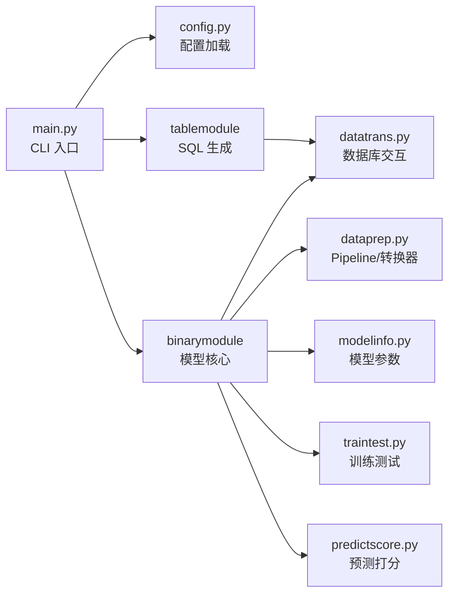

# AutoMining

[](LICENSE)
[](https://www.python.org/)
[](https://scikit-learn.org/)
[](https://lightgbm.readthedocs.io/)

## 项目介绍

AutoMining 是面向电信运营商客户经营场景的大数据分类挖掘程序。它实现了从数据加工、特征工程、模型训练、测试评估到预测打分与结果监控的**完整机器学习建模流程**，支持多业务场景（流失预警、套餐迁移、流量包推荐等）和多数据平台（PostgreSQL/Greenplum、Hive/Spark）。

适用于数据挖掘工程师、经营分析师快速构建和迭代二分类预测模型。

## 功能特性

- 🚀 **一键运行**：一条命令完成训练+预测全流程
- 🧩 **多场景覆盖**：内置流失预警、套餐迁移、加包推荐等 9+ 业务场景模型
- 🔄 **多数据源适配**：同时支持 PostgreSQL/Greenplum 和 Hive/Spark
- 📊 **自动化特征工程**：SQL 动态生成、字段两两衍生、IV 值筛选、相关性过滤
- 🤖 **多模型流水线**：LightGBM / XGBoost + 标准化/分箱预处理，sklearn Pipeline 封装
- 📈 **模型监控**：PSI 稳定度检测、KS/AUC 指标评估，及时预警模型衰减
- 📝 **灵活运行模式**：支持完整流程、仅训练、仅预测、仅生成 SQL 四种模式
- 💾 **内存分片**：大批量数据自动拆分预测，避免内存溢出

## 快速开始

### 环境要求

- Python 3.10+
- PostgreSQL 12+ 或 Greenplum（可选，使用 gp 数据库时）
- 操作系统：Windows / Linux / macOS

### 安装

```bash
# 克隆仓库
git clone <your-repo-url>
cd AutoMining

# 创建虚拟环境（推荐）
python -m venv .venv
source .venv/bin/activate   # Linux/macOS
.venv\Scripts\activate      # Windows

# 安装核心依赖
pip install -e .

# 如需 Hive/Spark 支持
pip install -e ".[hive]"
```

### 配置环境

在项目根目录创建 `.env` 文件（可参考 `.env` 示例），至少配置以下项：

```ini
# 平台选择: 本机测试 | 亚信jupyter
PLAT=本机测试

# 数据库类型: gp (PostgreSQL/Greenplum) | hive (Hive/Spark)
DB_TYPE=gp

```

### 验证安装

```bash
python main.py --show-config
```

如果正确打印出所有配置项，说明环境已就绪。

## 常见用法

### 运行完整流程（训练 + 预测）

```bash
python main.py
```

依次执行：数据加工 → 宽表探索 → 训练集加工 → 模型训练/测试 → 预测集加工 → 预测打分。适合首次运行或全量更新。

### 仅执行训练测试

```bash
python main.py --mode train
```

仅运行数据加工和模型训练/测试阶段，不会执行预测打分。适合调试特征工程和模型参数。

### 仅执行预测打分

```bash
python main.py --mode predict
```

加载已训练好的模型（`.pkl` 文件），对新一期数据进行预测打分。适合月度例行预测。

### 仅生成 SQL

```bash
python main.py --mode sql
```

在不连接数据库的情况下，仅打印数据加工 SQL。可将 SQL 复制到数据库客户端手动执行。

### 指定环境变量文件

```bash
python main.py --env .env.production
```

切换不同的环境配置文件，适配开发/测试/生产环境。

## 配置说明

所有配置通过项目根目录的 `.env` 文件管理，由 `Mining/config.py` 统一加载。

### 平台与系统

| 配置项 | 类型 | 默认值 | 说明 |
|--------|------|--------|------|
| `PLAT` | string | `本机测试` | 平台标识：`本机测试` 或 `亚信jupyter` |
| `SYS_TEM` | string | `win` | 操作系统类型：`win` 或 `linux` |

### 数据库连接

| 配置项 | 类型 | 默认值 | 说明 |
|--------|------|--------|------|
| `DB_TYPE` | string | `gp` | 数据库类型：`gp`（PostgreSQL/Greenplum）或 `hive`（Hive/Spark） |
| `DB_NAME` | string | — | 数据库名称 |
| `DB_USER` | string | — | 数据库用户名 |
| `DB_PWD` | string | — | 数据库密码 |
| `DB_PORT` | string | — | 数据库端口 |
| `DB_HOST` | string | — | 数据库主机地址 |
| `DB_PREFIX` | string | `ml.` | 表名前缀（schema 名称 + 点号） |
| `DB_SECONDS` | int | `5` | SQL 操作延时秒数 |

### SQL 执行模式

| 配置项 | 类型 | 默认值 | 说明 |
|--------|------|--------|------|
| `SQL_TYPE` | string | `execute` | SQL 执行方式：`execute`（数据库直连执行）或 `print`（仅打印 SQL） |
| `SQL_COMMENT` | string | `----` | SQL 注释字符 |
| `SRC` | string | `gp` | 数据读取来源：`gp`（数据库）或其他（文件） |

### 模型训练参数

| 配置项 | 类型 | 默认值 | 说明 |
|--------|------|--------|------|
| `AUTO_PAIR2` | bool | `false` | 是否进行字段两两自动衍生（加减乘除） |
| `DIFF_LIMIT` | string | `None` | 近 n 月基础数据账期分布差值阈值，`None` 不检查 |
| `TABLE_PSI` | bool | `true` | 是否计算结果宽表字段 PSI 稳定度 |
| `TABLE_R` | bool | `true` | 是否计算结果宽表字段间相关系数 |

### 预测阶段参数

| 配置项 | 类型 | 默认值 | 说明 |
|--------|------|--------|------|
| `N_REASON` | int | `3` | 匹配 Top-N 高分原因字段个数，`None` 不匹配 |
| `M_P` | string | `202012` | 预测数据账期，格式 `yyyymm` |

### 日志

| 配置项 | 类型 | 默认值 | 说明 |
|--------|------|--------|------|
| `LOG_TYPE` | string | `txt` | 日志类型：`txt`（文本日志）或 `pkl`（二进制日志） |

### 工作目录

| 配置项 | 类型 | 默认值 | 说明 |
|--------|------|--------|------|
| `MODELWD_PLATFORM` | string | — | 模型结果保存目录 |
| `SELFWD_PLATFORM` | string | — | 个人工作目录（代码上传、日志存储） |

## 项目架构

```
AutoMining/
├── main.py                  # 主入口（CLI 驱动，支持多种运行模式）
├── .env                     # 环境配置文件
├── pyproject.toml           # 项目元数据与依赖声明
├── Mining/
│   ├── config.py            # 配置加载模块（读取 .env，提供统一接口）
│   ├── build/               # 原有工作流入口脚本
│   │   ├── all_code.py      # 汇总代码并上传到平台
│   │   └── privy_build.py   # 预测/打分主函数（原有入口）
│   └── selfmodule/
│       ├── binarymodule/    # 二分类模型核心模块
│       │   ├── modelinfo.py     # 模型信息、参数配置、字段校验
│       │   ├── pipemodel.py     # sklearn Pipeline 流水线构建
│       │   ├── traintest.py     # 训练与测试主逻辑
│       │   ├── predictscore.py  # 预测打分
│       │   ├── privy_report.py  # 报表生成
│       │   └── privy_stat.py    # 统计工具
│       ├── tablemodule/     # 表结构与 SQL 工具
│       │   ├── basestr.py       # 数据字典/字段定义（需手动维护）
│       │   ├── tablefun.py      # 表操作函数
│       │   └── tablesql.py      # SQL 动态生成
│       └── toolmodule/      # 通用工具
│           ├── dataprep.py      # DataFrame 转换器、Pipeline 工具、命名元组
│           ├── datatrans.py     # 数据库交互（gp/hive）、全局配置
│           ├── predict_job.py   # 并行预测作业入口
│           ├── strtotable.py    # 字符串转表工具
│           └── ignorewarn.py    # 警告抑制
```

### 模块关系



## 使用注意

1. **配置先行**：运行前务必检查 `.env` 中的数据库连接参数和平台标识是否正确
2. **数据字典**：`basestr.py` 中的表结构定义需与实际数据库保持一致，列名不匹配会报错
3. **列名约定**：代码假定特定的列名（`col_target`、`col_month`、`col_id` 等），且会执行 `to_lower` 大小写转换
4. **内存管理**：大规模数据预测时，程序会自动分片处理，如有内存溢出会自动中断并提示
5. **路径兼容**：部分原有脚本包含 Windows 风格硬编码路径，跨平台运行时请优先使用 `main.py` 入口
6. **模型迭代**：定期更新模型配置（训练账期、特征阈值）并通过 KS/AUC 指标监控模型表现

## 开源协议

本项目采用 [MIT License](LICENSE)。

## 参与贡献

欢迎提交 Issue 和 Pull Request。

